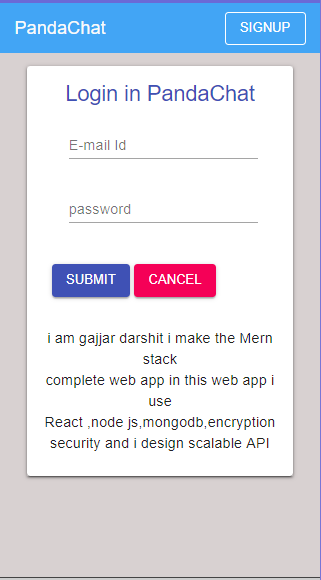
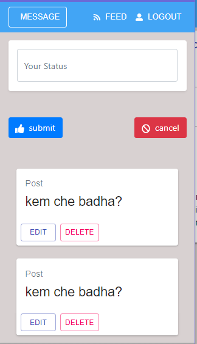

<p align="center">
  
</p>

<h1 align="center"> MERN stack base Todo chatting app in Devlopment Phase </h1>
<p align="center">
<a href="https://www.npmjs.com/package/react-poke-sprites">
  
</a>

<a href="https://github.com/anshumanv/react-poke-sprites">
  
</a>
</p>

<hr>

<p align="center">I create my own Rest Api</p>


### Installation
Install the npm module in your app directory.
```sh
npm install
```
# Frontends
<!--
  Ranking:
     1: React 
     2: React material Ui
     3: Bootstrap4
     4: font-awesome
-->
> _Sorted by popularity on Wed Jun 26 2019_

| 🥇 | 🥈 | 🥉 |
| :---:         |     :---:      |          :---: |
| [**React**<br/>   ](https://github.com/gothinkster/react-redux-realworld-example-app)| [**Angular**<br/>   ](https://github.com/gothinkster/angular-realworld-example-app)| [**Elm**<br/> ![Elm]
| [**React material Ui**<br/>   ](https://github.com/gothinkster/vue-realworld-example-app)| [**React / MobX**<br/>   ](https://github.com/gothinkster/react-mobx-realworld-example-app)| [**PureScript + Halogen**<br/>   ](https://github.com/thomashoneyman/purescript-halogen-realworld)
| [**Bootstrap4**<br/>   ](https://github.com/gothinkster/angularjs-realworld-example-app)| [**ClojureScript + re-frame**<br/>   ](https://github.com/jacekschae/conduit)| [**Svelte / Font-awesome**<br/>   ](https://github.com/sveltejs/realworld)

Work In Progress:
**[Implement Rest APi + Apollo/Relay for the Node + React codebases](https://github.com/gothinkster/realworld/issues/6) | 
[React + NextJS](https://github.com/gothinkster/realworld/issues/336)**

# Backends
<!--
  Ranking:
     1: Node / Express
     2: MVC architecture
     3: bcrypt JS
     4: jsonwebtoken
     5: mongodb
     6: passport
     7: passport-google-oauth20
     8: REST API
     -->
> _Sorted by popularity on Wed Jun 26 2019_

| 🥇 | 🥈 | 🥉 |
| :---:         |     :---:      |          :---: |
| [**Node / Express**<br/>   ](https://github.com/gothinkster/node-express-realworld-example-app)| [**ASP.NET Core**<br/>   ](https://github.com/gothinkster/aspnetcore-realworld-example-app)| [**Go + Gin**<br/>   ](https://github.com/gothinkster/golang-gin-realworld-example-app)
| [**MVC architecture**<br/>   ](https://github.com/gothinkster/laravel-realworld-example-app)| [**Django**<br/>   ](https://github.com/gothinkster/django-realworld-example-app)| [**Elixir + Phoenix**<br/>   ](https://github.com/gothinkster/elixir-phoenix-realworld-example-app)
| [**bcrypt js**<br/>   ](https://github.com/gothinkster/flask-realworld-example-app)| [**Spring**<br/>   ](https://github.com/gothinkster/spring-boot-realworld-example-app)| [**NestJS + TypeORM**<br/>   ](https://github.com/lujakob/nestjs-realworld-example-app)
| [**Json web Token**<br/>   ](https://github.com/gothinkster/slim-php-realworld-example-app)| [**Rails**<br/>   ](https://github.com/gothinkster/rails-realworld-example-app)| [**Kotlin / Spring**<br/>   ](https://github.com/gothinkster/kotlin-spring-realworld-example-app)
| [**MongoDb**<br/>   ](https://github.com/gothinkster/rust-realworld-example-app)| [**Koa / Knex**<br/>   ](https://github.com/gothinkster/koa-knex-realworld-example)| [**Rust / Rocket**<br/>   ](https://github.com/TatriX/realworld-rust-rocket)
| [**Passport JS**<br/>   ](https://github.com/furkan3ayraktar/clojure-polylith-realworld-example-app)| [**Serverless AWS Lambda DynamoDB**<br/>   ](https://github.com/anishkny/realworld-dynamodb-lambda)| [**Scala & Play Framework**<br/>   ](https://github.com/gothinkster/scala-play-realworld-example-app)
| [**passport-google-oauth20**<br/>   ](https://github.com/gothinkster/cakephp-realworld-example-app)| [**GCP Cloud Functions + Datastore**<br/>   ](https://github.com/gothinkster/gcp-datastore-cloud-functions-realworld-example-app)| [**Haskell / Yesod**<br/>   ](https://github.com/tzemanovic/haskell-yesod-realworld-example-app)
| [**REST APi**<br/>   ](https://github.com/err0r500/go-realworld-clean)
| [**Heroku/AWS**<br/>   ](https://github.com/xesina/golang-echo-realworld-example-app)| [**F#**<br/>   ](https://github.com/gothinkster/fsharp-realworld-example-app)| [**Kotlin + Javalin + Exposed**<br/>   ](https://github.com/Rudge/kotlin-javalin-realworld-example-app)

### web app images
  
  <br/><br/><br/><br/><br/><br/><br/><br/><br/><br/><br/><br/><br/><br/><br/><br/><br/><br/>

### Credits
```txt
this web app specially i design because i know MERN stack but i not make my demo web app in mern stack so specially i design
this web app to inhabce my skill.
```
## Tools and Technology


## Author

[Darshit Gajjar](https://github.com/gajjardarshithasmukhbhai)

[](https://www.linkedin.com/in/darshit-gajjar-532098152/)


## Contribute
Found a bug, please contact my website [create an issue](https://github.com/gajjardarshithasmukhbhai/MERN-STACK-web-app/issues/new)


## License

[](https://github.com/gajjardarshithasmukhbhai/react-poke-sprites/blob/master/LICENSE)
> © Darshit Gajjar(Full stack devloper)
